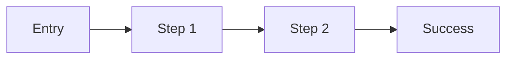

# UX Specification: [Title]

**Status:** [Draft | Approved | In Progress | Done]  
**Designer:** [Name]  
**Date:** [YYYY-MM-DD]  
**Related Spec:** [docs/specs/feature-*.md]  
**Related Stories:** [US-001, US-002, ...]

---

## Overview

[What experience does this design deliver and for whom?]

## Target Users & Devices

- **Primary users:** [Persona / role]
- **Devices:** [Mobile / Tablet / Desktop]
- **Breakpoints:** [e.g. sm 640, md 768, lg 1024, xl 1280, 2xl 1536]

## User Flows

[Describe or diagram the key flows. Mermaid example below.]

## Wireframes / Layout

[ASCII/text wireframes or links. Describe layout structure and visual hierarchy per screen.]

## Component Inventory

| Component | Reused / New | Props / State notes | Source |
|-----------|--------------|---------------------|--------|
| | | | |

## UI States

For each screen/component, define all states:

| Screen / Component | Loading | Empty | Error | Success |
|--------------------|---------|-------|-------|---------|
| | | | | |

## Design Tokens

| Token | Value | Usage |
|-------|-------|-------|
| color.primary | | |
| spacing.base | | |
| typography.body | | |
| radius.default | | |
| elevation.card | | |

## Responsive Behavior

- [Mobile-first layout notes]
- [Per-breakpoint changes]

## Content / UX Copy

| Location | Copy | Notes |
|----------|------|-------|
| | | |

## Accessibility Checklist (WCAG 2.2 AA)

- [ ] Color contrast >= 4.5:1 (text) / 3:1 (large text & UI components)
- [ ] Fully keyboard navigable (logical tab order)
- [ ] Visible focus indicators on all interactive elements
- [ ] Focus management for modals/overlays/dynamic content
- [ ] Semantic HTML / appropriate ARIA roles and labels
- [ ] Form fields have associated labels and error messaging
- [ ] `prefers-reduced-motion` fallbacks for animations
- [ ] Touch targets >= 44x44px
- [ ] Content reflows without horizontal scroll at 320px width

## UX Acceptance Criteria

### US-001
- [ ] [Testable UX criterion]
- [ ] [Testable UX criterion]

## Open Questions

- [ ] [Question — owner]

## Approval

- [ ] UX Designer sign-off
- [ ] Product Owner review
- [ ] Frontend Developer feasibility confirmation
