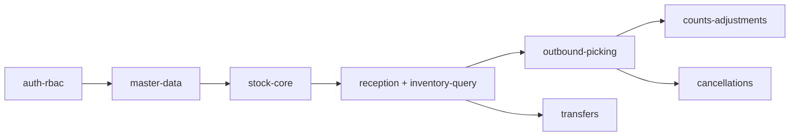

> Language: English | [Español](#versión-en-español)

# Architecture Review: WMS MVP — warehouse-mvp

**Reviewer:** Rails Architect  
**Date:** 2026-06-16  
**Spec:** [warehouse-mvp.md](../specs/warehouse-mvp.md)  
**Verdict:** **APPROVED WITH CONDITIONS**

---

## Summary

The product spec can be built as a Rails monolith with the agreed stack. The data model is consistent for a multi-warehouse distributor. **5 Accepted ADRs** are issued to govern the blocking decisions identified in the spec.

Implementation can start in **Phase 0** (`auth-rbac`, `master-data`, `stock-core`) as long as the conditions listed at the end are met.

---

## Architectural decisions issued

| ADR | Title | Status |
|-----|--------|--------|
| [ADR-0001](adr-0001-stock-updater-single-writer.md) | StockUpdater as the single writer | Accepted |
| [ADR-0002](adr-0002-outbound-stock-reservations.md) | Location-level reservations when picking starts | Accepted |
| [ADR-0003](adr-0003-picking-location-allocation.md) | Greedy by location order | Accepted |
| [ADR-0004](adr-0004-warehouse-module-boundaries.md) | `Warehouse::` namespace and structure | Accepted |
| [ADR-0005](adr-0005-erp-integration-layer.md) | Integration layer with no coupling to the ERP | Accepted |

**Technical design:** [warehouse-mvp.md](../design/warehouse-mvp.md)

---

## Strengths of the product design

1. **Vertical slices** in the roadmap aligned with real data dependencies.
2. **Append-only audit trail** well thought out; it fits compensating cancellations.
3. **Scoped approvals** only where there is risk (adjustments, cancellations) — reduces operational friction.
4. **Multi-warehouse** with two-phase transfers is the correct minimum viable approach for a distributor.
5. **ERP readiness** without over-engineering (importer + external_references).

---

## Findings and resolutions

### BLOCKING (resolved in ADRs)

| # | Finding | Resolution |
|---|----------|------------|
| B1 | No single contract for stock mutation | ADR-0001 `Warehouse::StockUpdater` |
| B2 | Timing and granularity of reservations not defined | ADR-0002 reserve at `start_picking`, by location |
| B3 | Ambiguous picking algorithm ("FIFO") | ADR-0003 greedy by aisle/rack/position |
| B4 | Code structure for 3 devs in parallel | ADR-0004 `Warehouse::` namespace |
| B5 | ERP integration with no pattern | ADR-0005 `Integration::*` + `ExternalReference` |

### CONCERNS (implementation conditions)

| # | Risk | Required mitigation |
|---|--------|----------------------|
| C1 | Denormalized `warehouse_id` in `stock_levels` can get out of sync | Validate in `StockUpdater`; coherence test |
| C2 | Transfer without a virtual location: stock "disappears" in transit | Documented; UI must show `in_transit` in the transfer report; do not count it as available |
| C3 | Cancelling a `transfer_in` that was already received | US-035 blocks a simple cancellation; force a reverse transfer — **add an E2E test** |
| C4 | Concurrency in picking | Pessimistic locks ADR-0001 + mandatory integration tests |
| C5 | Counting with stock in motion | Snapshot `system_quantity` at count **submit** (confirmed in the design) |
| C6 | Long `StartPicking` transaction | Keep the allocator at O(n) locations; monitor; no async job needed in the MVP |

### SUGGESTIONS (non-blocking)

| # | Suggestion |
|---|------------|
| S1 | Add `lock_version` to `reception_lines` and `picking_lines` |
| S2 | Validate integer quantities for discrete units in the `Product` model |
| S3 | Initial CSV load: reuse `Integration::ProductImporter` (ADR-0005 dogfooding) |
| S4 | `warehouse_sequences` table for document numbers without race conditions |
| S5 | Future infra ADR: Solid Queue vs Sidekiq once there is an AWS deployment |

---

## Adjustments to the data model (vs the original spec)

| Entity | Change |
|---------|--------|
| `picking_lines` | + `status` (`pending`, `picked`, `skipped`) |
| `reception_lines` | + `lock_version` |
| `stock_movements` | `location_id` required for location-based operations |
| New `warehouse_sequences` | Generates `REC/OUT/TRF` numbers |

---

## Confirmed merge order

**Hard gate:** any PR that writes `quantity_on_hand` or `quantity_reserved` outside `StockUpdater` does not pass code review.

---

## Unblocked stories

All P0 stories are **unblocked for implementation** after this review, with implementation following ADRs 0001–0005 and the [technical design](../design/warehouse-mvp.md).

| Phase | Stories | Prerequisite |
|------|-----------|--------------|
| 0 | US-001–004, US-040 | ADR-0004 |
| 0 | US-005, US-041 | ADR-0001, ADR-0004 |
| 1 | US-010–011, US-030 | stock-core merged |
| 2 | US-020–023 | ADR-0002, ADR-0003 |
| 3 | US-031–035, US-034 | ADR-0001 |

---

## Conditions (must be met in PRs)

1. [ ] `Warehouse::StockUpdater` merged with concurrency tests before reception/outbound
2. [ ] Pundit policies for the US-040 matrix in the same PR as the mutating endpoints
3. [ ] Migrations with indexes per the technical design
4. [ ] No new gems without justification in an ADR
5. [ ] MySQL DBA review on the PR with the `stock_levels` and `stock_movements` migrations

---

## Sign-off

- [x] Rails Architect — **APPROVED WITH CONDITIONS** (2026-06-16)
- [x] ADRs 0001–0005 — **Accepted**
- [x] MySQL DBA review — APPROVED WITH CONDITIONS (2026-06-16) — [migrations review](warehouse-mvp-migrations-review.md)

---

## Versión en español

# Architecture Review: WMS MVP — warehouse-mvp

**Reviewer:** Rails Architect  
**Date:** 2026-06-16  
**Spec:** [warehouse-mvp.md](../specs/warehouse-mvp.md)  
**Verdict:** **APPROVED WITH CONDITIONS**

---

## Summary

La especificación de producto es implementable en Rails monolito con el stack acordado. El modelo de datos es coherente para una distribuidora multi-almacén. Se emiten **5 ADRs Accepted** que gobiernan las decisiones bloqueantes identificadas en la spec.

La implementación puede iniciar en **Fase 0** (`auth-rbac`, `master-data`, `stock-core`) cumpliendo las condiciones listadas al final.

---

## Decisiones arquitectónicas emitidas

| ADR | Título | Estado |
|-----|--------|--------|
| [ADR-0001](adr-0001-stock-updater-single-writer.md) | StockUpdater como único escritor | Accepted |
| [ADR-0002](adr-0002-outbound-stock-reservations.md) | Reservas location-level al iniciar picking | Accepted |
| [ADR-0003](adr-0003-picking-location-allocation.md) | Greedy por orden de ubicación | Accepted |
| [ADR-0004](adr-0004-warehouse-module-boundaries.md) | Namespace `Warehouse::` y estructura | Accepted |
| [ADR-0005](adr-0005-erp-integration-layer.md) | Capa Integration sin acoplamiento a ERP | Accepted |

**Diseño técnico:** [warehouse-mvp.md](../design/warehouse-mvp.md)

---

## Fortalezas del diseño de producto

1. **Vertical slices** del roadmap alineados con dependencias reales de datos.
2. **Auditoría append-only** bien planteada; encaja con cancelaciones compensatorias.
3. **Aprobaciones acotadas** solo donde hay riesgo (ajustes, cancelaciones) — reduce fricción operativa.
4. **Multi-almacén** con transferencias en dos fases es el mínimo viable correcto para distribuidora.
5. **Preparación ERP** sin sobre-ingeniería (importer + external_references).

---

## Hallazgos y resoluciones

### BLOCKING (resueltos en ADRs)

| # | Hallazgo | Resolución |
|---|----------|------------|
| B1 | Sin contrato único de mutación de stock | ADR-0001 `Warehouse::StockUpdater` |
| B2 | Momento y granularidad de reservas no definidos | ADR-0002 reserva al `start_picking`, por ubicación |
| B3 | Algoritmo de picking ambiguo ("FIFO") | ADR-0003 greedy por aisle/rack/position |
| B4 | Estructura de código para 3 devs en paralelo | ADR-0004 namespace `Warehouse::` |
| B5 | Integración ERP sin patrón | ADR-0005 `Integration::*` + `ExternalReference` |

### CONCERNS (condiciones de implementación)

| # | Riesgo | Mitigación requerida |
|---|--------|----------------------|
| C1 | `warehouse_id` denormalizado en `stock_levels` puede desincronizarse | Validación en `StockUpdater`; test de coherencia |
| C2 | Transferencia sin ubicación virtual: stock "desaparece" en tránsito | Documentado; UI debe mostrar `in_transit` en reporte de transferencias; no contar como disponible |
| C3 | Cancelación de `transfer_in` ya recibido | US-035 bloquea cancelación simple; forzar transferencia inversa — **añadir test E2E** |
| C4 | Concurrencia en picking | Locks pesimistas ADR-0001 + tests de integración obligatorios |
| C5 | Conteo con stock en movimiento | Snapshot `system_quantity` al **submit** del conteo (confirmado en diseño) |
| C6 | `StartPicking` transacción larga | Mantener allocator O(n) ubicaciones; monitorizar; no requiere job async en MVP |

### SUGGESTIONS (no bloqueantes)

| # | Sugerencia |
|---|------------|
| S1 | Añadir `lock_version` en `reception_lines` y `picking_lines` |
| S2 | Validar cantidades enteras para unidades discretas en modelo `Product` |
| S3 | CSV carga inicial: reutilizar `Integration::ProductImporter` (ADR-0005 dogfooding) |
| S4 | Tabla `warehouse_sequences` para números de documento sin race conditions |
| S5 | ADR futuro de infra: Solid Queue vs Sidekiq cuando exista despliegue AWS |

---

## Ajustes al modelo de datos (vs spec original)

| Entidad | Cambio |
|---------|--------|
| `picking_lines` | + `status` (`pending`, `picked`, `skipped`) |
| `reception_lines` | + `lock_version` |
| `stock_movements` | `location_id` obligatorio en operaciones por ubicación |
| Nueva `warehouse_sequences` | Generación de números `REC/OUT/TRF` |

---

## Orden de merge confirmado

**Gate duro:** ningún PR que escriba `quantity_on_hand` o `quantity_reserved` fuera de `StockUpdater` pasa code review.

---

## Historias desbloqueadas

Todas las P0 quedan **desbloqueadas para implementación** tras este review, con implementación conforme a ADRs 0001–0005 y [diseño técnico](../design/warehouse-mvp.md).

| Fase | Historias | Prerequisito |
|------|-----------|--------------|
| 0 | US-001–004, US-040 | ADR-0004 |
| 0 | US-005, US-041 | ADR-0001, ADR-0004 |
| 1 | US-010–011, US-030 | stock-core mergeado |
| 2 | US-020–023 | ADR-0002, ADR-0003 |
| 3 | US-031–035, US-034 | ADR-0001 |

---

## Conditions (deben cumplirse en PRs)

1. [ ] `Warehouse::StockUpdater` mergeado con tests de concurrencia antes de reception/outbound
2. [ ] Políticas Pundit para matriz US-040 en mismo PR que endpoints mutantes
3. [ ] Migraciones con índices según diseño técnico
4. [ ] Sin gems nuevas sin justificación en ADR
5. [ ] MySQL DBA review en PR con migraciones de `stock_levels` y `stock_movements`

---

## Sign-off

- [x] Rails Architect — **APPROVED WITH CONDITIONS** (2026-06-16)
- [x] ADRs 0001–0005 — **Accepted**
- [x] MySQL DBA review — APPROVED WITH CONDITIONS (2026-06-16) — [migrations review](warehouse-mvp-migrations-review.md)
