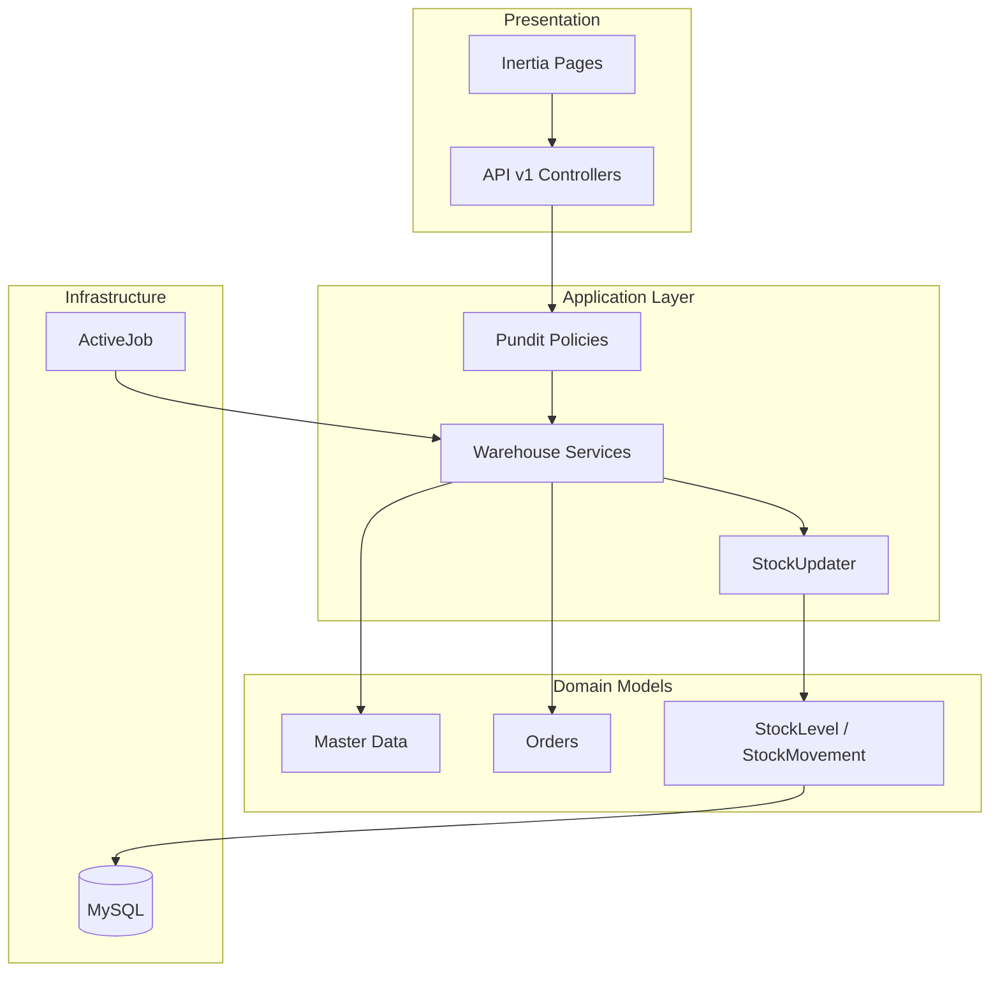

# Technical Design: WMS MVP — Distribución Multi-Almacén

**Status:** Approved  
**Author:** Rails Architect  
**Date:** 2026-06-16  
**Spec:** [warehouse-mvp.md](../specs/warehouse-mvp.md)  
**ADRs:** [0001](adr-0001-stock-updater-single-writer.md), [0002](adr-0002-outbound-stock-reservations.md), [0003](adr-0003-picking-location-allocation.md), [0004](adr-0004-warehouse-module-boundaries.md), [0005](adr-0005-erp-integration-layer.md)

---

## Overview

Sistema WMS monolito Rails para distribuidora multi-almacén. El inventario se modela por producto-ubicación con reservas en salidas. Toda mutación de stock pasa por `Warehouse::StockUpdater` con auditoría append-only. UI vía Inertia/React; API REST versionada `/api/v1/warehouse/`.

## Requirements

- Multi-almacén con transferencias en dos fases (ship → receive)
- Recepción, salida/picking, conteo, ajustes con aprobación, cancelaciones con aprobación
- RBAC: admin, supervisor, operario, consulta
- Consulta inventario < 3 s (hasta ~10k `stock_levels`)
- Sin integración Odoo en v1; capa `Integration::*` preparada

## Architecture



### Components

| Component | Responsibility | Location |
|-----------|----------------|----------|
| `StockUpdater` | Único writer de stock + auditoría | `app/services/warehouse/stock_updater.rb` |
| `StartPicking` | Validar, allocar, reservar | `app/services/warehouse/outbound/start_picking.rb` |
| `LocationAllocator` | Greedy por ubicación | `app/services/warehouse/picking/location_allocator.rb` |
| `Approve` (adjustments) | Flujo aprobación → StockUpdater | `app/services/warehouse/adjustments/approve.rb` |
| `ProductImporter` | Stub integración / CSV catálogo | `app/services/integration/product_importer.rb` |
| Policies | RBAC por recurso | `app/policies/warehouse/` |

## Data Model

### Ajustes respecto a la spec de producto

| Tema | Ajuste arquitectónico |
|------|----------------------|
| `warehouse_id` en `stock_levels` | Denormalizado; **validar** `== location.warehouse_id` en cada escritura |
| `stock_movements.location_id` | **Obligatorio** salvo reportes agregados; transferencias generan 2 movimientos (out/in) con ubicación |
| Decimales | `decimal(15,3)`; validar enteros para `unidad`, `caja`, `paquete` en capa modelo |
| `picking_lines` | Añadir `status` enum: `pending`, `picked`, `skipped` |
| `reception_lines` | Añadir `lock_version` para optimistic locking en confirmación concurrente |

### Índices críticos (MySQL InnoDB)

```sql
-- stock_levels
UNIQUE (product_id, location_id)
INDEX (warehouse_id, product_id)

-- stock_movements
INDEX (product_id, occurred_at)
INDEX (warehouse_id, occurred_at)
INDEX (reference_type, reference_id)

-- products
UNIQUE (sku)
UNIQUE (barcode)  -- MySQL permite múltiples NULL

-- locations
UNIQUE (warehouse_id, code)
```

### Migraciones — orden obligatorio

1. `users` + Devise
2. `warehouses`, `categories`, `products`, `locations`, `external_references`
3. `stock_levels`, `stock_movements`, `warehouse_sequences`
4. `reception_orders`, `reception_lines`
5. `outbound_orders`, `outbound_lines`, `picking_lines`
6. `transfer_orders`, `transfer_lines`
7. `inventory_counts`, `inventory_count_lines`
8. `inventory_adjustments`, `inventory_adjustment_lines`
9. `movement_cancellations`

## API / Interface

### Patrón

- REST JSON bajo `/api/v1/warehouse/`
- Respuestas de error: `{ errors: [{ field, message }] }` con HTTP 422
- Paginación: `page`, `per_page` (default 50, max 100)

### Endpoints núcleo (MVP)

| Método | Ruta | Acción |
|--------|------|--------|
| GET | `/api/v1/warehouse/inventory` | US-030 consulta |
| GET | `/api/v1/warehouse/stock_movements` | US-041 auditoría |
| POST | `/api/v1/warehouse/reception_orders` | US-010 |
| POST | `/api/v1/warehouse/reception_orders/:id/confirm_line` | US-011 |
| POST | `/api/v1/warehouse/outbound_orders` | US-020 |
| POST | `/api/v1/warehouse/outbound_orders/:id/start_picking` | US-020/021/023 |
| POST | `/api/v1/warehouse/picking_lines/:id/confirm` | US-022 |
| POST | `/api/v1/warehouse/transfer_orders/:id/ship` | US-034 |
| POST | `/api/v1/warehouse/transfer_orders/:id/receive` | US-034 |
| POST | `/api/v1/warehouse/inventory_adjustments` | US-032 |
| POST | `/api/v1/warehouse/inventory_adjustments/:id/approve` | US-033 |
| POST | `/api/v1/warehouse/movement_cancellations` | US-035 |

### Inertia pages (mínimo)

- `/warehouse/inventory` — consulta
- `/warehouse/reception_orders/:id` — recepción tablet
- `/warehouse/outbound_orders/:id/picking` — picking tablet
- `/warehouse/adjustments/pending` — cola supervisor

## Security

- **Authentication:** Devise session + CSRF en Inertia; token/API key diferido post-MVP
- **Authorization:** Pundit en cada acción mutante; matriz US-040
- **Segregación:** operario no aprueba propias solicitudes (US-033, US-035)
- **Auditoría:** `stock_movements` sin endpoints UPDATE/DELETE
- **Data classification:** datos operativos internos; sin PII sensible más allá de usuarios

## Testing Strategy

| Capa | Enfoque |
|------|---------|
| Unit | `LocationAllocator`, `AvailabilityChecker`, validaciones modelo |
| Integration | `StockUpdater` concurrencia; `StartPicking` reserva+alloc; flujos approve/reject |
| Request | Policies por rol; endpoints críticos |
| Manual | Tablet picking, transferencia 2 almacenes, conteo→ajuste→aprobación |

### Escenarios de concurrencia obligatorios

1. Dos `StartPicking` simultáneos sobre mismo producto/almacén
2. `ConfirmLine` picking + `StartPicking` otro pedido misma ubicación
3. Aprobación ajuste con reservas activas que bloquean

## Rollout

- **Feature flag:** no requerido (greenfield); opcional `WAREHOUSE_ENABLED` si se monta en app existente
- **Migration order:** según sección Data Model
- **Semillas:** 2 almacenes, 20 productos, 50 ubicaciones, 1 admin para staging

## Open Questions

- [x] Serializer: **Alba** por defecto (ligero, Rails 8 compatible) — confirmar en primer PR de API
- [ ] Job queue: Solid Queue vs Sidekiq según infra AWS — decidir en ADR de infra
- [ ] Soft delete global: **no** en MVP; usar `active` boolean
