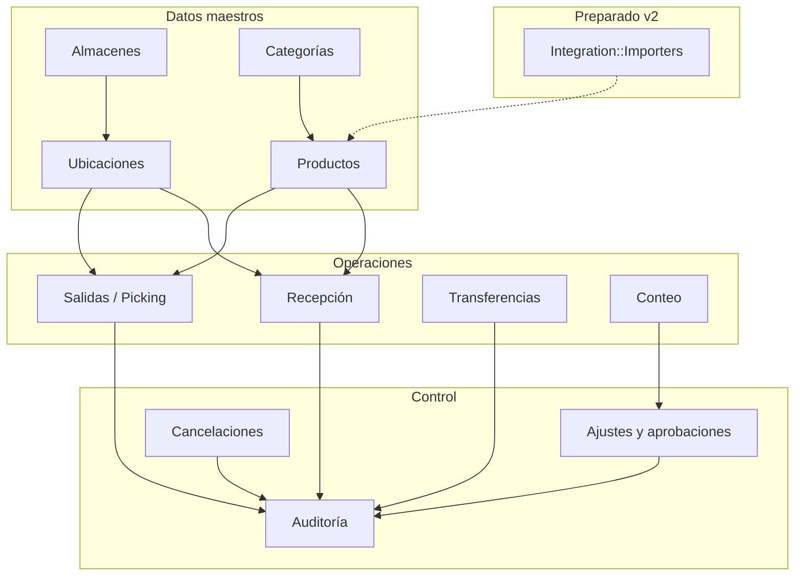
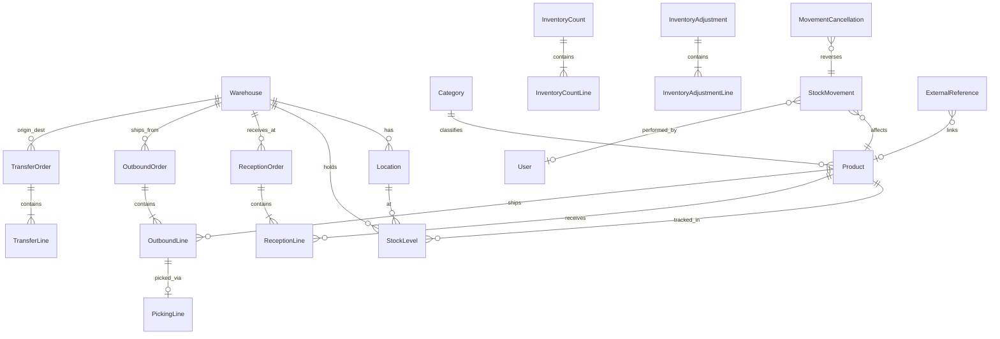
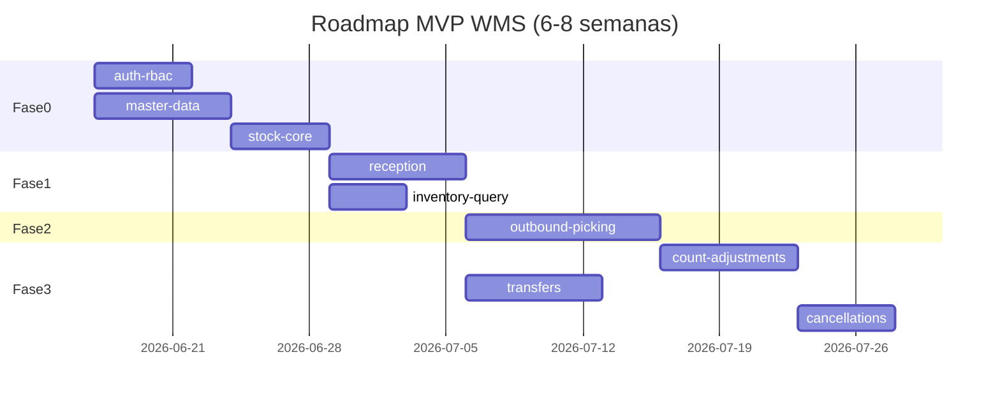

# Feature: WMS MVP — Distribución Multi-Almacén

**Status:** Approved  
**Author:** Product Owner  
**Date:** 2026-06-16  
**Stakeholders:** Dirección comercial, Operaciones de almacén, IT  
**Spec ID:** `warehouse-mvp`

---

## Problem Statement

Una empresa distribuidora/comercializadora opera varios almacenes con control de inventario fragmentado (hojas de cálculo, registros manuales). No hay visibilidad unificada del stock, los movimientos no son auditables y las discrepancias se detectan tarde. Se necesita un WMS mínimo viable que centralice inventario multi-almacén sin depender aún de integración con ERP.

## Contexto de negocio

- **Sector:** Distribución / comercialización de productos físicos.
- **Operación:** Múltiples almacenes (sedes o centros de distribución), recepción de proveedores, preparación de pedidos de clientes, transferencias entre almacenes.
- **v1:** Arranque en blanco; sin integración Odoo. Arquitectura preparada para importadores/servicios futuros.

---

## Decisiones cerradas

| # | Tema | Decisión |
|---|------|----------|
| D1 | ERP | Arranque en blanco. Sin Odoo en v1. Preparar capa de integración (`Integration::*`, referencias externas, importadores). |
| D2 | Código de barras | No obligatorio. Búsqueda por SKU, nombre y categoría. Campo `barcode` opcional en productos. |
| D3 | Unidades | Enum fijo: `unidad`, `caja`, `paquete`, `kg`, `litro`. Sin conversiones automáticas en v1. Modelo extensible para conversiones futuras. |
| D4 | Aprobaciones | Salidas normales sin aprobación. Sí requieren aprobación de supervisor: ajustes manuales, correcciones de stock (conteo) y cancelaciones de movimientos confirmados. |
| D5 | Alcance geográfico | Multi-almacén incluido en MVP (gestión de almacenes, stock por almacén, transferencias). |
| D6 | Integración futura | Patrón importer + `external_references` polimórficas; sin acoplar lógica de dominio a Odoo. |

---

## Goals

| ID | Objetivo | Métrica de éxito (90 días post go-live) |
|----|----------|------------------------------------------|
| G1 | Visibilidad de stock multi-almacén | Consulta de disponibilidad por producto/almacén en < 3 s; 0 hojas de cálculo operativas |
| G2 | Trazabilidad de movimientos | 100 % de entradas, salidas, transferencias y ajustes aprobados quedan en auditoría |
| G3 | Reducir errores operativos | −40 % discrepancias en picking vs baseline manual |
| G4 | Control de correcciones | 100 % de ajustes y cancelaciones pasan por flujo de aprobación |
| G5 | Base para integración ERP | Contrato de importador documentado; al menos un stub de `ProductImporter` implementable sin refactor |

## Non-Goals (fuera de MVP)

- Integración en tiempo real con Odoo u otro ERP
- Conversiones automáticas entre unidades de medida
- Código de barras obligatorio o hardware de escaneo dedicado
- App móvil nativa
- Lotes, series, caducidad (FEFO/FIFO)
- Optimización de rutas de picking
- Facturación, compras, CRM
- Cross-docking, ondas, kitting
- Impresión de etiquetas ZPL
- Reservas automáticas desde e-commerce
- Permisos granulares por zona de almacén
- Multi-idioma

---

## Usuarios y roles

| Rol | Descripción | Permisos clave |
|-----|-------------|----------------|
| **admin** | Configuración del sistema | CRUD catálogo, almacenes, ubicaciones, usuarios; ver todo |
| **supervisor** | Control operativo | Aprobar ajustes, correcciones y cancelaciones; conteos; reportes |
| **operario** | Ejecución en piso | Recepción, picking, transferencias, solicitar ajustes/cancelaciones |
| **consulta** | Solo lectura | Consultar stock e historial; sin modificar |

---

## Módulos MVP



| Módulo | Responsabilidad |
|--------|-----------------|
| Almacenes | CRUD de almacenes activos/inactivos |
| Catálogo | Categorías y productos (SKU, nombre, categoría, unidad, barcode opcional) |
| Ubicaciones | Jerarquía por almacén: pasillo → estante → posición |
| Inventario | Stock por producto + ubicación + almacén; disponible vs reservado |
| Recepción | Orden → confirmación → incremento de stock |
| Salidas | Orden → picking → confirmación → decremento de stock |
| Transferencias | Envío entre almacenes con estados borrador → en tránsito → recibido |
| Conteo y ajustes | Conteo físico; solicitud de corrección; aprobación supervisor |
| Cancelaciones | Solicitud y aprobación para revertir movimiento confirmado |
| Usuarios | Autenticación y RBAC básico |
| Auditoría | `StockMovement` inmutable por cada cambio de stock |
| Integración (stub) | Interfaz importador; `ExternalReference` polimórfico |

---

## Historias P0 (índice)

| ID | Título | Dependencias |
|----|--------|--------------|
| [US-001](../stories/warehouse-mvp/US-001.md) | Gestión de categorías | — |
| [US-002](../stories/warehouse-mvp/US-002.md) | Gestión de productos | US-001 |
| [US-003](../stories/warehouse-mvp/US-003.md) | Gestión de almacenes | — |
| [US-004](../stories/warehouse-mvp/US-004.md) | Gestión de ubicaciones | US-003 |
| [US-005](../stories/warehouse-mvp/US-005.md) | Carga de stock inicial | US-002, US-004 |
| [US-010](../stories/warehouse-mvp/US-010.md) | Crear orden de recepción | US-002, US-003 |
| [US-011](../stories/warehouse-mvp/US-011.md) | Confirmar recepción | US-010, US-005 |
| [US-020](../stories/warehouse-mvp/US-020.md) | Crear orden de salida | US-002, US-003 |
| [US-021](../stories/warehouse-mvp/US-021.md) | Lista de picking | US-020 |
| [US-022](../stories/warehouse-mvp/US-022.md) | Confirmar picking | US-021 |
| [US-023](../stories/warehouse-mvp/US-023.md) | Alerta de stock insuficiente | US-020 |
| [US-030](../stories/warehouse-mvp/US-030.md) | Consulta de inventario multi-almacén | US-005 |
| [US-031](../stories/warehouse-mvp/US-031.md) | Conteo de inventario | US-005 |
| [US-032](../stories/warehouse-mvp/US-032.md) | Solicitar ajuste o corrección de stock | US-031 |
| [US-033](../stories/warehouse-mvp/US-033.md) | Aprobar o rechazar ajustes | US-032 |
| [US-034](../stories/warehouse-mvp/US-034.md) | Transferencia entre almacenes | US-005 |
| [US-035](../stories/warehouse-mvp/US-035.md) | Cancelar movimiento confirmado | US-011, US-022 |
| [US-040](../stories/warehouse-mvp/US-040.md) | Gestión de usuarios y roles | — |
| [US-041](../stories/warehouse-mvp/US-041.md) | Historial de movimientos | US-005 |

---

## Modelo inicial de datos

### Diagrama entidad-relación (conceptual)



### Entidades y atributos clave

#### `warehouses`
| Campo | Tipo | Notas |
|-------|------|-------|
| id | PK | |
| code | string, unique | Ej. `CD-MAD`, `CD-BCN` |
| name | string | |
| address | text, optional | |
| active | boolean | Inactivo: no nuevas operaciones |
| timestamps | | |

#### `categories`
| Campo | Tipo | Notas |
|-------|------|-------|
| id | PK | |
| name | string, unique | |
| parent_id | FK optional | Jerarquía simple (1 nivel en MVP) |
| active | boolean | |
| timestamps | | |

#### `products`
| Campo | Tipo | Notas |
|-------|------|-------|
| id | PK | |
| sku | string, unique | |
| name | string | |
| category_id | FK | |
| unit_type | enum | `unidad`, `caja`, `paquete`, `kg`, `litro` |
| barcode | string, nullable, unique | Opcional v1 |
| min_stock_level | decimal, optional | Alerta P1; campo presente, lógica P1 |
| active | boolean | |
| timestamps | | |

> **Extensibilidad unidades (v2):** tabla `unit_conversions` (`product_id`, `from_unit`, `to_unit`, `factor`) sin usar en v1.

#### `locations`
| Campo | Tipo | Notas |
|-------|------|-------|
| id | PK | |
| warehouse_id | FK | |
| code | string | Único por almacén. Ej. `A-01-03` |
| aisle | string | |
| rack | string | |
| position | string | |
| active | boolean | |
| timestamps | | |

**Índice único:** `(warehouse_id, code)`

#### `stock_levels`
| Campo | Tipo | Notas |
|-------|------|-------|
| id | PK | |
| product_id | FK | |
| location_id | FK | |
| warehouse_id | FK | Denormalizado para consultas |
| quantity_on_hand | decimal(15,3) | Físico en ubicación |
| quantity_reserved | decimal(15,3) | Reservado por salidas en curso |
| timestamps | | |

**Índice único:** `(product_id, location_id)`  
**Disponible:** `quantity_on_hand - quantity_reserved` (calculado, no persistido)

#### `stock_movements` (auditoría inmutable)
| Campo | Tipo | Notas |
|-------|------|-------|
| id | PK | |
| product_id | FK | |
| warehouse_id | FK | |
| location_id | FK, nullable | Null en transferencias agregadas |
| movement_type | enum | `reception`, `outbound`, `transfer_out`, `transfer_in`, `adjustment`, `cancellation` |
| quantity | decimal | Positivo entrada, negativo salida |
| quantity_before | decimal | |
| quantity_after | decimal | |
| reference_type | string | Polimórfico: `ReceptionLine`, `PickingLine`, etc. |
| reference_id | bigint | |
| user_id | FK | |
| notes | text, optional | |
| occurred_at | datetime | |
| cancelled_at | datetime, nullable | Si fue revertido |
| timestamps | | |

#### `reception_orders` / `reception_lines`
- **Order:** `warehouse_id`, `supplier_name`, `reference_number`, `status` (`draft`, `partial`, `completed`, `cancelled`), `received_by`, timestamps
- **Line:** `reception_order_id`, `product_id`, `expected_quantity`, `received_quantity`, `location_id` (al confirmar), `status`

#### `outbound_orders` / `outbound_lines` / `picking_lines`
- **Order:** `warehouse_id`, `customer_name`, `reference_number`, `status` (`draft`, `picking`, `partial`, `completed`, `cancelled`)
- **Line:** `product_id`, `requested_quantity`, `picked_quantity`, `status`
- **PickingLine:** `outbound_line_id`, `location_id`, `quantity_to_pick`, `quantity_picked`, `sequence` (orden por ubicación)

#### `transfer_orders` / `transfer_lines`
- **Order:** `origin_warehouse_id`, `destination_warehouse_id`, `status` (`draft`, `in_transit`, `partial`, `completed`, `cancelled`), `shipped_at`, `received_at`
- **Line:** `product_id`, `requested_quantity`, `shipped_quantity`, `received_quantity`

**Regla:** Al enviar (`in_transit`), se descuenta stock en origen. Al recibir en destino, se incrementa en ubicación de recepción del almacén destino.

#### `inventory_counts` / `inventory_count_lines`
- **Count:** `warehouse_id`, `status` (`in_progress`, `submitted`, `closed`), `started_by`, `submitted_at`
- **Line:** `product_id`, `location_id`, `system_quantity`, `counted_quantity`, `variance`

#### `inventory_adjustments` / `inventory_adjustment_lines`
- **Adjustment:** `source_type` (`manual`, `count`), `inventory_count_id` nullable, `status` (`pending`, `approved`, `rejected`), `requested_by`, `approved_by`, `reason`, timestamps
- **Line:** `product_id`, `location_id`, `quantity_before`, `quantity_change`, `quantity_after`

#### `movement_cancellations`
| Campo | Tipo | Notas |
|-------|------|-------|
| stock_movement_id | FK | Movimiento a revertir |
| status | enum | `pending`, `approved`, `rejected` |
| requested_by | FK | |
| approved_by | FK, nullable | |
| reason | text | Obligatorio |
| reversal_movement_id | FK, nullable | Movimiento compensatorio al aprobar |

#### `external_references` (preparación Odoo)
| Campo | Tipo | Notas |
|-------|------|-------|
| referable_type | string | `Product`, `Warehouse`, etc. |
| referable_id | bigint | |
| source_system | string | Ej. `odoo` |
| external_id | string | ID en sistema externo |
| last_synced_at | datetime, nullable | |

**Índice único:** `(source_system, external_id, referable_type)`

#### `users` / roles
- Rol almacenado como enum en `users.role`: `admin`, `supervisor`, `operario`, `consulta`
- Autenticación: según stack del proyecto (Devise u equivalente)

### Servicios de dominio (preliminares)

| Servicio | Responsabilidad |
|----------|-----------------|
| `StockUpdater` | Único punto de mutación de `stock_levels`; siempre crea `stock_movement` |
| `ReservationService` | Reserva/libera stock al crear picking |
| `AdjustmentWorkflow` | Solicitud → aprobación → aplicación vía `StockUpdater` |
| `CancellationWorkflow` | Solicitud → aprobación → movimiento compensatorio |
| `Integration::ProductImporter` | Interfaz: `#import(row)` → `Product`; implementación stub en v1 |
| `Integration::ImportResult` | Value object: `success`, `errors`, `record` |

---

## Reglas de negocio transversales

1. **SKU único** a nivel sistema; **código de ubicación único** por almacén.
2. **Barcode único** cuando está presente (puede ser null).
3. **Stock nunca negativo** en `quantity_on_hand` ni en disponible (`on_hand - reserved`).
4. **Mutación de stock** solo a través de `StockUpdater` (servicio transaccional).
5. **Movimientos auditados** son append-only; correcciones vía movimiento compensatorio o cancelación aprobada.
6. **Salidas normales** no requieren aprobación de supervisor.
7. **Ajustes, correcciones de conteo y cancelaciones** requieren aprobación de `supervisor` o `admin`.
8. **Almacén inactivo:** no permite nuevas recepciones, salidas ni transferencias; consulta permitida.
9. **Producto inactivo:** no aparece en nuevas órdenes; stock existente sigue visible.
10. **Transferencia:** stock sale del origen al marcar `in_transit`; entra al destino al confirmar recepción de transferencia.
11. **Sin conversiones de unidad:** cantidades siempre en la unidad del producto.

---

## Criterio de MVP listo

La empresa puede operar durante **2 semanas** con al menos **2 almacenes** activos:

- Recepciones y salidas diarias sin Excel
- Al menos 1 transferencia entre almacenes completada
- 1 ciclo de conteo con ajuste aprobado
- 1 cancelación de movimiento aprobada
- Consulta de stock consolidada y por almacén
- Auditoría consultable por producto

---

## Roadmap de implementación por ramas

Diseñado para **2–3 desarrolladores** trabajando en paralelo con merges frecuentes a `main` (o `develop`). Cada rama es un vertical slice mergeable con feature flags si aplica.

### Convenciones

- Prefijo de rama: `feature/warehouse-<slice>`
- Cada rama incluye: migraciones, modelos, servicios, API/UI mínima, tests del slice
- **No iniciar slice N+1** hasta que las migraciones del slice N estén en la rama base

### Fase 0 — Fundación (Semana 1)

| Rama | Owner sugerido | Entregables | Historias |
|------|----------------|-------------|-----------|
| `feature/warehouse-auth-rbac` | Dev C | Users, roles, políticas Pundit/CanCan, layout base | US-040 |
| `feature/warehouse-master-data` | Dev A | Warehouses, categories, products, locations, `ExternalReference` stub | US-001, US-002, US-003, US-004 |
| `feature/warehouse-stock-core` | Dev B | `stock_levels`, `stock_movements`, `StockUpdater`, carga inicial CSV | US-005, US-041 (parcial) |

**Merge order:** auth → master-data → stock-core



### Fase 1 — Entradas y consulta (Semana 2–3)

| Rama | Owner | Entregables | Historias |
|------|-------|-------------|-----------|
| `feature/warehouse-reception` | Dev B | Reception orders, confirmación, integración `StockUpdater` | US-010, US-011 |
| `feature/warehouse-inventory-query` | Dev A | Búsqueda por SKU/nombre/categoría, filtros multi-almacén | US-030 |

**Paralelo:** Dev B recepción + Dev A consulta (ambos dependen de stock-core).

### Fase 2 — Salidas (Semana 3–5)

| Rama | Owner | Entregables | Historias |
|------|-------|-------------|-----------|
| `feature/warehouse-outbound` | Dev C | Outbound orders, reservas, alertas stock | US-020, US-023 |
| `feature/warehouse-picking` | Dev C | Picking list, confirmación, decremento stock | US-021, US-022 |

**Secuencial dentro del equipo C:** outbound → picking (misma rama o sub-ramas).

### Fase 3 — Control y transferencias (Semana 5–7)

| Rama | Owner | Entregables | Historias |
|------|-------|-------------|-----------|
| `feature/warehouse-transfers` | Dev A | Transfer orders, in_transit, recepción destino | US-034 |
| `feature/warehouse-counts` | Dev B | Conteo, solicitud corrección | US-031, US-032 |
| `feature/warehouse-adjustments-approval` | Dev B | Flujo aprobación ajustes | US-033 |
| `feature/warehouse-cancellations` | Dev C | Cancelación movimientos confirmados | US-035 |

**Paralelo:** transfers (A) + counts/adjustments (B) + cancellations (C) tras picking mergeado.

### Fase 4 — Integración stub y hardening (Semana 7–8)

| Rama | Owner | Entregables |
|------|-------|-------------|
| `feature/warehouse-integration-stub` | Dev A | `Integration::ProductImporter`, README integración, tests contrato |
| `feature/warehouse-audit-ui` | Dev C | US-041 UI completa, export CSV movimientos |
| `fix/warehouse-e2e-hardening` | Todos | Pruebas E2E flujos críticos, corrección bugs |

### Asignación sugerida por desarrollador

| Dev | Foco principal | Ramas |
|-----|----------------|-------|
| **Dev A** | Datos maestros, consultas, transferencias, integración | master-data, inventory-query, transfers, integration-stub |
| **Dev B** | Stock core, recepción, conteos y aprobaciones | stock-core, reception, counts, adjustments-approval |
| **Dev C** | Auth, salidas, picking, cancelaciones, auditoría UI | auth-rbac, outbound, picking, cancellations, audit-ui |

### Puntos de sincronización (daily / twice-weekly)

1. **Contrato `StockUpdater`** — bloqueante para reception, picking, transfers, adjustments
2. **Estados de órdenes** — enum compartido documentado antes de outbound
3. **Políticas de autorización** — matriz rol × acción antes de aprobaciones

---

## Preparación integración Odoo (v2)

```
app/
  services/
    integration/
      base_importer.rb       # interface común
      product_importer.rb    # stub v1; implementación Odoo v2
      import_result.rb
  models/
    external_reference.rb
```

**Contrato `ProductImporter#import(row)`:**
- Input: `{ sku:, name:, category_name:, unit_type:, barcode: nil, external_id: }`
- Output: `ImportResult` con producto creado/actualizado o errores de validación
- Idempotente por `external_id` + `source_system: 'odoo'`

---

## Technical Considerations

- Stack objetivo: Rails + MySQL + React/Inertia (según estándares del proyecto)
- Transacciones DB en todos los flujos de stock
- ADR recomendado: `StockUpdater` como único writer de inventario
- ADR recomendado: estrategia de reservas en salidas
- Performance: índices en `stock_levels(warehouse_id, product_id)`, `stock_movements(product_id, occurred_at)`
- Seguridad: RBAC en API y UI; auditoría no editable

## Dependencies

- Ninguna integración externa en v1
- Infraestructura según `.ai/standards/aws-infrastructure.md` cuando exista app desplegada

## Open Questions

- [ ] ¿Proveedor se modela como entidad o campo texto en recepción? → **MVP: campo texto `supplier_name`**
- [ ] ¿Cliente en salida: entidad o texto? → **MVP: campo texto `customer_name`**
- [ ] ¿Límite de almacenes en v1? → **Sin límite técnico; operación esperada: 2–10**

## Approval

- [x] Product Owner sign-off
- [ ] Rails Architect review (pendiente ADR StockUpdater y reservas)
