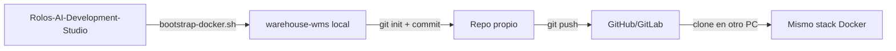

# Pasar de scaffold Docker a repositorio propio

La app **no debe vivir dentro** de `Rolos-AI-Development-Studio`. El bootstrap crea un directorio hermano (por defecto `../warehouse-wms`) que ya es tu proyecto independiente.

---

## Flujo recomendado



---

## Paso 1 — Generar la app (solo Docker)

Desde el framework repo:

```bash
cd examples/warehouse-wms
chmod +x bin/bootstrap-docker.sh bin/rails-new-docker.sh
./bin/bootstrap-docker.sh
# o ruta custom:
# ./bin/bootstrap-docker.sh ~/projects/warehouse-wms
```

Esto crea `warehouse-wms/` con:

| Contenido | Origen |
|-----------|--------|
| App Rails 8 + MySQL | `rails new` en contenedor |
| `docker-compose.yml`, `Dockerfile.dev` | scaffold |
| Migraciones Fase 0 | `examples/warehouse-wms/db/migrate/` |
| `StockUpdater` stub | `app/services/warehouse/` |
| Spec, ADRs, stories, runbook | copia de `docs/` del framework |
| `.ai/` | copia opcional para agentes Cursor |

---

## Paso 2 — Base de datos y servidor

```bash
cd ../warehouse-wms   # o tu ruta

docker compose run --rm web rails db:create db:migrate
docker compose up
```

Comandos habituales **sin Rails local**:

```bash
docker compose run --rm web bundle exec rspec
docker compose run --rm web rails console
docker compose run --rm web rails generate model ...
docker compose exec web bash
```

---

## Paso 3 — Crear repositorio remoto propio

El bootstrap ya hace `git init` + commit inicial.

### GitHub (gh CLI)

```bash
cd ~/projects/warehouse-wms
gh repo create warehouse-wms --private --source=. --remote=origin --push
```

### Sin gh CLI

```bash
git remote add origin git@github.com:TU_ORG/warehouse-wms.git
git push -u origin main
```

A partir de aquí **trabajas solo en `warehouse-wms`**. El framework repo queda como referencia de agentes/skills, no como monorepo obligatorio.

---

## Paso 4 — En otro equipo o máquina

```bash
git clone git@github.com:TU_ORG/warehouse-wms.git
cd warehouse-wms
cp .env.example .env   # si no existe .env
docker compose build
docker compose run --rm web bundle install
docker compose run --rm web rails db:create db:migrate
docker compose up
```

No necesitas Ruby ni Rails instalados en el host.

---

## Qué mantener sincronizado con el framework

| En `warehouse-wms` | ¿Actualizar desde framework? |
|--------------------|------------------------------|
| `docs/specs`, `docs/architecture` | Solo si cambia el producto; copia manual o submodule |
| `.ai/` agents/skills | Opcional: submodule o copia periódica |
| Migraciones ya aplicadas | **No** reemplazar; evolucionar en el repo de la app |
| `StockUpdater` | Implementar en app; usar ejemplo solo como referencia inicial |

### Submodule opcional (solo documentación)

Si quieres specs siempre al día sin mezclar código:

```bash
cd warehouse-wms
git submodule add git@github.com:Rohega/Rolos-AI-Development-Studio.git vendor/ai-studio
ln -s vendor/ai-studio/docs/specs docs/specs-framework  # opcional
```

La mayoría de equipos **copian docs una vez** y evolucionan en el repo de la app.

---

## Ramas de implementación (en tu repo)

Trabaja en `warehouse-wms`, no en el framework:

```bash
git checkout -b feature/warehouse-auth-rbac
# ...
git push -u origin feature/warehouse-auth-rbac
```

Orden de merge: ver `docs/runbooks/warehouse-mvp-phase-0-kickoff.md`.

---

## WSL + Docker Desktop

Si `docker` no funciona en WSL:

1. Instala [Docker Desktop](https://www.docker.com/products/docker-desktop/)
2. Settings → Resources → WSL Integration → activa tu distro
3. Reinicia la terminal WSL
4. Verifica: `docker info`

---

## Troubleshooting

| Problema | Solución |
|----------|----------|
| Puerto 3307 ocupado | Cambia `MYSQL_PORT` en `.env` |
| `bundle install` lento | Normal la primera vez; usa volumen `bundle_cache` |
| Permisos archivos creados por Docker | `sudo chown -R $USER:$USER .` en WSL si hace falta |
| `rails new` falla por red | Reintenta; gem install necesita internet |
| Migración Devise antes de `add_role` | Ejecuta `rails generate devise:install` y `devise User` antes de `db:migrate` |

### Orden Devise (después del bootstrap)

```bash
docker compose run --rm web bash bin/setup-devise.sh
docker compose run --rm web rails db:create db:migrate
```

No uses `add_role_to_users` por separado: `role` va dentro de la migración `devise_create_users`.

### Error: Failed to open the referenced table 'users' (stock_movements)

`stock_movements` tiene FK a `users`, pero la migración Devise tiene timestamp posterior a las WMS. Solución:

```bash
# Renombrar devise para que corra primero (antes de 00002)
mv db/migrate/*devise_create_users*.rb db/migrate/20260616100001_devise_create_users.rb

docker compose run --rm web rails db:migrate
```

O vuelve a ejecutar `bin/setup-devise.sh` (ya renombra automáticamente).

### Error: Duplicate column name 'email' (add_devise_to_users)

Tienes **dos** migraciones Devise: `devise_create_users` (correcta) y `add_devise_to_users` (sobra). No reinicies todo:

```bash
rm db/migrate/*add_devise_to_users*.rb
docker compose run --rm web rails db:migrate:status   # todo debe estar "up"
```

Solo reinicia desde cero si quieres DB limpia:

```bash
docker compose down -v
docker compose run --rm web rails db:create db:migrate
```

La migración `20260616100001_add_role_to_users` corre **antes** que Devise. Solución:

```bash
rm db/migrate/*add_role_to_users*.rb
docker compose run --rm web bash bin/setup-devise.sh
docker compose run --rm web rails db:migrate
```

Si ya generaste Devise manualmente, basta con borrar `add_role_to_users` y añadir en `*devise_create_users*.rb` antes de `t.timestamps`:

```ruby
t.integer :role, null: false, default: 2
```

### Gemfile: mysql2 duplicado

`rails new --database=mysql` ya añade `mysql2`. Si `bundle install` falla por duplicado, edita `Gemfile` y **elimina la línea extra** `gem "mysql2"` al final (deja solo la de rails: `gem "mysql2", "~> 0.5"`).

---

## Resumen

1. **Ahora:** `./bin/bootstrap-docker.sh` → carpeta `warehouse-wms` con Docker.
2. **Después:** `git push` a tu repo propio → equipo clona y usa `docker compose up`.
3. **Nunca** dependas de Rails en el host; todo va en contenedor `web`.
